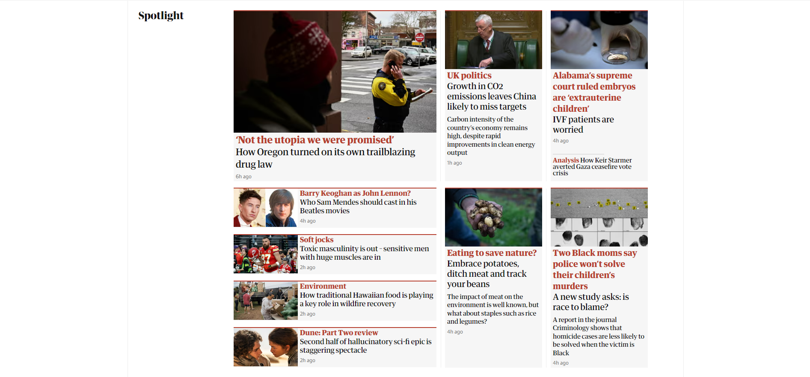

# 👀 Clone coded Website

1. 일간지 "[가디언](https://www.theguardian.com/international)"
1. 클론 사이트 "[바로가기](https://hyejeong-clone-coding-theguardian.netlify.app/)"

## 왜 이 웹사이트를 선택했는지?

1. 분량은 많지만 CSS나 Javascript 기능을 많이 활용할 필요는 없는 것처럼 보였습니다.
1. grid와 flex 연습을 많이 할 수 있을 것으로 보였습니다.
1. CSS 스타일 옵션 적용 연습을 많이 할 수 있을 것으로 보였습니다.

## 작업 기간

2024년 2월 19일~25일

## 구현

1. HTML, CSS 위주로 작성했습니다.
1. grid, flex 기능 위주로 사용했습니다.
1. Guardian지에서 제공하는 폰트 css 파일을 가져다 글꼴을 적용했습니다([가디언 깃허브](https://github.com/guardian/fonts?tab=readme-ov-file)).
1. header, nav, aside, section, footer 태그를 사용했습니다.
1. section 태그에 grid를 적용해 각 기사 내용을 담았습니다.
1. 분량이 너무 많아 비슷한 것들은 중간 생략을 하되, 여러 옵션을 적용해야 하고 다루기에 재미있어 보이는 섹션을 골라 가능한 한 비슷하게 따라했습니다.

## 이미지

1. header, nav, aside 영역

1. section 영역(spotlight 카테고리)

1. footer 영역

## 좋은 점(어, 이게 되네?)
1. grid 기능의 몇몇 응용법을 익힐 수 있었습니다(grid-column: n/n, order etc.). 
1. ::before, ::after, :hover 등 가상 요소와 가상 선택자의 응용법을 익힐 수 있었습니다.
1. :root 기능으로 미리 특정 옵션을 지정한 덕에 속도를 낼 수 있었습니다.

## 아쉬운 점(어, 왜 안 되지?)
1. Javascript를 잘 이해하지 못해 Podcast 섹션에서 슬라이드 적용을 못 했습니다.
1. 코드가 매우 지저분합니다.
1. 내비게이션 바에 토글 기능을 넣지 못했습니다.
1. 각 섹션마다 창 감추기 기능이 있으나 넣지 못했습니다.
1. 작명 방법이 엉망진창입니다.
1. 귀찮다는 이유로 div 태그를 너무 많이 사용했습니다. 코드가 지저분해지고 클래스 이름이 엉망인 것은 이것이 원인일 것입니다.
1. 코드가 지저분해지면서 position: relative, position: absolute를 적재적소에 배치하는 데 큰 어려움을 느꼈습니다. 마찬가지 이유로 flex 스타일을 지정하는 데에도 어려움이 있었습니다. 이는 과제 진행이 더뎌지는 주된 원인이 되었습니다.
1. Tip us off 섹션의 눈 그림에는 마우스 포인터를 쫓아가는 기능이 있는데 Javascript를 사용해야 하는 탓에 따라하지 못했습니다(매우 아쉬움).
1. 헤더 상단에 스크롤을 내리면 사라지는 광고판이 있는데 따라하지 못했습니다.

## 앞으로 개선하고 싶은 점(고칠 게 너무 많은데...)
1. 가독성이 상당히 안 좋습니다. 여러 모로 좀 더 깔끔하게 작성할 필요가 있습니다.
1. flex 기능을 다시 확인하고 공부할 필요가 있습니다.
1. class 이름을 지을 때 난잡하지 않고, 알아보기 쉽게 지을 필요가 있습니다.
1. javascript를 이용한 애니메이션 효과를 더 알아보고 싶습니다.
1. 웹사이트 클론 코딩을 할 때 속도감 있는 개발을 해내면서도 그 내용이 중구난방하지 않으려면 지금처럼 웹사이트에 있는 내용을 보이는 대로 바로바로 베낄 것이 아니라, (1) 전체 구조 파악 이후 (2) 태그와 스타일 구조 선정을 먼저 진행해 어떤 기능을 넣을지 꼼꼼히 정리하는 데 시간을 더 들인 다음, (3) 정리한 내용을 바탕으로 작성을 하는 편이 더 나을 것 같습니다.